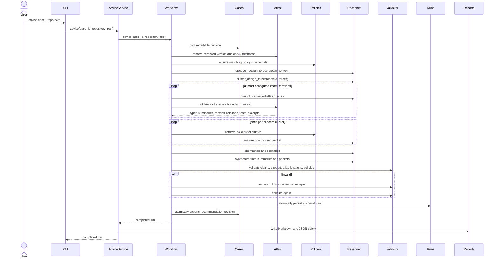

# Advisory workflow

Greenfield and brownfield advice use one pipeline. Brownfield adds an optional atlas and focused
query loop. The CLI delegates to `AdviceService`; the workflow owns reasoning and the atomic
successful run/case commit, while the report service writes the completed report into the
workspace.

Global context contains only the case summary, goals, constraints, future changes, non-goals,
actors/workflows, facts, assumptions, unresolved questions, and an optional high-level atlas
summary. The reasoner must partition all discovered forces exactly once into one to four concern
clusters. Invalid, duplicate, omitted, or invented force IDs fail structured-output validation.

Each zoom iteration has one cluster-keyed planning call. `max_queries_per_iteration` is a global
budget shared by every cluster in that iteration. `max_query_results` limits unique nodes per
cluster across the complete consultation, and `max_excerpt_lines` limits total excerpt lines per
cluster. The workflow clamps excess results and records query, node, and excerpt truncation in
execution metadata.

One `FocusedAnalysisPacket` is built per cluster. It contains explicit node summaries, metrics,
relationships whose endpoints were selected, related test IDs, excerpts, retrieved policies,
assumptions, and uncertainty. Each packet is analysed once. Scenario results are keyed by
alternative ID and every scenario must cover every alternative exactly once.

The final reasoner receives structured concern analyses, not the full atlas. Reference validation
permits one deterministic, conservative repair constrained to surfaced nodes and retrieved
policies. It removes unsupported evidence rather than asking a model to regenerate the full
report. A repository observation with an invalid source location is removed as a whole; repair
never strips the location while leaving its prose. Remaining errors fail the run explicitly.

## Atlas selection and audit

For CLI advice, an explicit `--repo` selects that repository's latest persisted atlas. Otherwise
the case's recorded atlas version is used; a case with only a recorded root uses its latest
version. A case without repository data is greenfield. Programmatic `atlas_version_id` selection
also reloads a persisted version; arbitrary unsaved atlas aggregates are never trusted as
evidence. Every selected brownfield atlas is freshness-checked before reasoning.

A successful brownfield consultation records the exact atlas root and version in the next case
revision. The case records only policy IDs cited by the final report or conflict analysis.

After a valid case revision is loaded, any terminal atlas resolution/freshness, policy, query,
provider, structured-output, validation, rendering, or commit failure is persisted as an
immutable failed run before the exception is returned. Runs contain only prompt identities that
were actually executed, stage timings, clusters, plans, packets, analyses, validation errors
before and after repair, repair actions, a failure stage, sanitized errors, and execution
counters/truncations. Failed runs retain partial or invalid model output for diagnosis without
applying success-only partition/coverage invariants, and they never advance the case revision.
