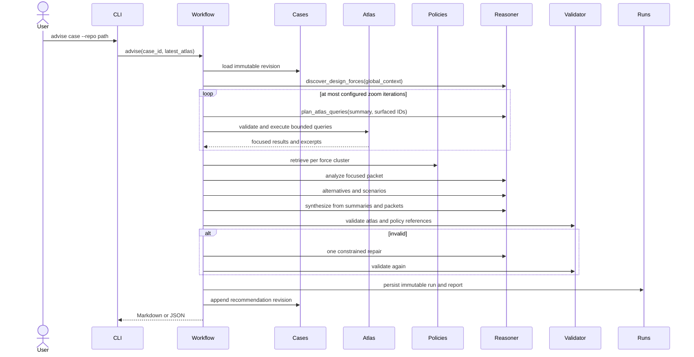

# Advisory workflow

Greenfield and brownfield advice use one pipeline. Brownfield adds an optional atlas and focused
query loop.

Global context contains only the case summary, goals, constraints, future changes, non-goals,
facts, assumptions, and optional high-level atlas summary. A focused packet contains one concern
cluster, its rationale, selected nodes, metrics and blast-radius results, small excerpts, related
tests, retrieved policies, assumptions, and uncertainty.

The final reasoner receives structured concern analyses, not the full atlas. Reference validation
permits one repair constrained to the surfaced node IDs and retrieved policy IDs. Remaining errors
fail the run explicitly.

