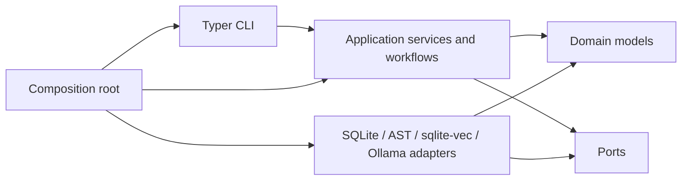

# Architecture

## Dependency direction

The domain contains validated application data and explicit errors. Ports describe persistence,
repository analysis, query, retrieval, and reasoning capabilities. Application services and
workflows depend on domain contracts and ports. Adapters implement ports. The CLI is a thin
presentation adapter. `bootstrap.py` is the composition root and the only module that chooses
providers.

The domain and application packages do not import Typer, HTTPX, SQLite, `sqlite-vec`, or AST
implementation modules. A structural test enforces this boundary.

## Responsibilities

- Domain: immutable schemas, IDs, classifications, source locations, and errors.
- Application: case operations, evidence validation, report rendering, and the unified workflow.
- Ports: narrow interfaces for owned external behavior.
- Persistence adapters: connection lifecycle, migrations, immutable revisions and versions.
- Repository adapters: path safety, Python parsing, graph metrics, and deterministic queries.
- Retrieval adapters: policy parsing, chunking, embeddings, and vector search.
- Model adapters: structured reasoning tasks and embeddings.
- Presentation: arguments, output, and exit behavior only.

Heavyweight or provider-specific behavior is constructed explicitly. Imports have no side effects.

## Information flow

Global context remains concise. Detailed code is requested only through a validated
`AtlasQueryPlan`; the query executor bounds types, IDs, result sizes, depth, and source excerpts.
Final synthesis receives the case, atlas summary, concern analyses, alternatives, scenarios, and
focused packets. It never receives an `Atlas` aggregate or repository root.

