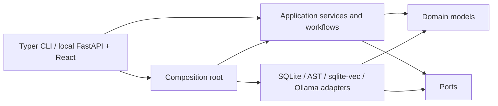

# Architecture

## Dependency direction

The domain contains validated application data and explicit errors. Ports describe persistence,
repository analysis, source/freshness checks, retrieval, reasoning, and report output.
Application services and workflows depend on domain contracts and cohesive ports. Adapters
implement ports. The CLI is a thin presentation adapter. `bootstrap.py` is the composition root
and the only module that chooses providers.

The domain, application, workflow, and port packages do not import Typer, HTTPX, SQLite,
`sqlite-vec`, or adapter implementations. Structural tests enforce this boundary and ensure CLI
commands use application services instead of concrete repositories, analyzers, or stores.

## Responsibilities

- Domain: immutable schemas, IDs, classifications, source locations, and errors.
- Application: case, policy-source/index, repository-index, fresh-atlas-query, advice, report,
  run, workspace-initialization, safety, and evidence-validation use cases.
- Workflows: the unified consultation sequence and its audit/failure envelope.
- Ports: narrow model/reasoning, atlas/source/freshness, policy, persistence, and reporting
  interfaces.
- Persistence adapters: connection lifecycle, migrations, immutable revisions and versions.
- Repository adapters: one-snapshot Python parsing, graph metrics, safe source reads, and
  deterministic typed queries.
- Retrieval adapters: policy parsing, chunking, embeddings, and vector search.
- Model adapters: structured reasoning tasks and embeddings.
- Presentation: input validation, application-service calls, output, and exit behavior only.

The local web adapter adds no alternate domain path. FastAPI routes call the same application
services as the CLI, while the React bundle consumes JSON and server-sent progress events from
that adapter. A single-worker application queue fixes a run ID and input case revision before
calling the consultation workflow.

Heavyweight or provider-specific behavior is constructed explicitly. Imports have no side effects.
The packaged model configuration is a resource; workspace initialization copies it only when the
selected configuration path does not exist.

## Information flow

Global context remains concise. Detailed code is requested only through a validated
`AtlasQueryPlan`; the query executor bounds types, IDs, result sizes, depth, and source excerpts.
Design forces are partitioned into validated concern clusters, and detailed results are assembled
into one focused packet per cluster under cumulative node and excerpt budgets. Final synthesis
receives the case, global context, forces, clusters, concern analyses, alternatives, scenarios,
and focused packets. It never receives an `Atlas` aggregate, repository root, or complete source
tree.
