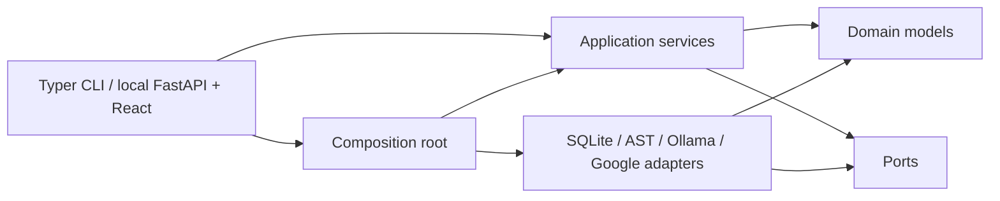

# Architecture

This file carries two things: the settled reference (dependency direction and information
flow, further down), and — first — whatever is currently *under discussion*. The working
rule: when a flow feels wrong, the reasoning lands here before any code changes. What is
actually happening, why, and the options — discussed, then decided with a dated note.
Superseded thinking stays visible rather than being rewritten away.

## Under discussion: the subsequent-review flow, and what the product is organised around
*(opened 2026-08-05 — nothing in this section is decided)*

### The flow as built

- A **run** starts from a case, an atlas of the repository, and the policy corpus. It
  detects boundaries, judges each one, and then either **asks** (first pass, when verdicts
  rest on unstated things → `awaiting_answers`) or **concludes** (second pass, or a first
  pass with nothing to ask). Answers append a case revision; the second pass judges
  against it. Reviews are immutable documents; the listing folds a run's passes into one
  row.
- **Identity ladder:** `repo_id` from the root commit (path hash when the folder is not a
  git root) → `branch_id` → `boundary_fingerprint` (pattern + sorted participants), which
  is what baselines, standing decisions, and the verdict cache all key on.
- **Verdict cache:** key = boundary fingerprint + policy corpus fingerprint + **case_id +
  case revision** + model + prompt. Hit → the verdict is carried verbatim.
- **Baseline:** per branch, per fingerprint. Disposition in a new run: `new` (not in the
  baseline), `changed` (**the material flag differs from the baselined one**), `known`.
- **Cases:** every run started from the start step creates a **fresh case with a random
  id** (`new_id("case")`) — including a re-run of the same repository or example.

### What stays

The per-boundary **standing decision** — accept / waive / park, with its append-only
discussion, attached to (branch, boundary fingerprint) and never influencing verdicts —
is the keeper. Whatever the flow becomes, decisions and their threads must survive it
unchanged.

### The two symptoms, traced

**"It asks the same questions again."** A fresh case is empty, so elicitation sees the
same unstated things. The answers given last run exist — on the previous run's case,
which nothing connects to the new one.

**"Something turns to `changed` without any code change."** Two causes stacking:

1. The fresh `case_id` defeats the verdict cache — its key includes `case_id`, so a
   re-run from the UI re-judges every boundary even when repository, policies, case
   content, model and prompt are all identical.
2. A re-judge is sampling a model, and judgements are not deterministic: a material flag
   can flip with nothing having moved. The baseline cannot tell that flip from a real one
   because **disposition is keyed on the verdict (an output), while the reader hears
   "changed" as a statement about the inputs** (the code, the answers, the policies).

Cause 1 is mechanical. Cause 2 is the architectural question, and it survives any fix to
cause 1: it recurs whenever a *legitimate* re-judge happens (a policy edited, an answer
added, a model upgraded).

### The question to settle first

> Is a verdict allowed to change when none of its inputs changed?

A verdict's inputs are the cache key minus the case-identity accident: the boundary's
shape, the policy corpus, what the case says, the model, the prompt. If **no**: the cache
stops being an optimisation and becomes the **authority** — an unchanged question keeps
its answered verdict, re-judging happens only when an input moved, and every `changed`
can name the input that moved it. If **yes** (fresh judgement is a feature): instability
must become a visible category of its own — "the verdict moved, nothing else did" — and
must never wear the same word as a code change.

### The grouping question

The UI grew review-first: `/reviews` is the front page of results, and repositories were
retrofitted as sections around the rows. But the durable objects are attached to the
**repository and its branch** — baseline, standing decisions, the verdict history, and
(if continuity wins above) the case itself. That suggests a repository-first shape:

- A **repositories** surface: one entry per code base ArchCompass knows, named the way
  the user names it (folder or git remote), branch visible only when real.
- A **repository page** owning what belongs to the repo: its runs (newest first), its
  baseline and what's unresolved against it, its standing decisions, its case.
- A run's page stays what it is; `/reviews` as a flat cross-repo history either goes or
  demotes to an archive view.

How the user wants to *say* which code base a run is about (pick a folder, paste a git
URL, re-pick a known repo in one click) is part of the same question — the start step and
the grouping should agree on what a "repository" is.

### Directions to weigh (they compose)

- **A. Case continuity** — a re-run continues the repository's newest case (answers
  included); "start clean" is explicit. Fixes re-asking directly and most of symptom 2 by
  side effect (same case + revision → cache hits). *Built speculatively on branch
  `w1-case-continuity`, deliberately unmerged pending this discussion.*
- **B. The case belongs to the repository/branch outright** — the first-class version of
  A: one living case per (repo, branch), runs pin its revisions, the start step edits
  rather than creates it.
- **C. Verdicts move only when inputs move** — replace `case_id` in the cache key with a
  fingerprint of what the case says; carry-through becomes the rule; the re-judge
  triggers are named explicitly (content, corpus, answers, model, or a person pressing
  "re-judge").
- **D. Split what `changed` can mean** — *code changed* / *answers changed* / *verdict
  moved, nothing changed*; the last surfaced as instability, never as a red CHANGED chip,
  and never blocking CI.
- **E. Agreement before a flip counts** — where a genuine re-judge happens, a material
  flip needs a second sample to agree before it earns `changed` (n=1 is not a
  measurement).
- **F. Repository-first UI** — the grouping question above, made the navigation model.

### The shape the user described (2026-08-05, later the same day)

Settled in intent, not yet in mechanics:

- **Every code base is a git repository.** Reviewing a bare folder stays possible but is
  the degraded case, not a peer; pasting an address is a first-class way in (shipped:
  `POST /api/repositories/checkout` + the start-page picker).
- **Repository → branch → one living review.** The repository is the parent section.
  Each branch is its own scope — its own baseline, standing decisions, case. A branch has
  *one* review with numbered **revisions**: a new run appends a revision, the review page
  offers a revision picker with a `latest` tag, and older revisions stay readable. (This
  is directions B + F; it also dissolves the reviews-page grouping question — the page
  becomes repositories, each holding branches, each holding one review.)

The named hard part: **keeping a line through revisions while the code itself changes** —
baselines and accept/waive/park decisions must follow a boundary across runs, but a
boundary is identified by its fingerprint (pattern + participant names), and code changes
can move, rename, or dissolve the participants.

**Three layers, worth separating, because they change at different speeds:**

1. the **question** — "does this boundary earn its place?", identified by fingerprint;
2. the **verdict** — what the model said about it in one revision;
3. the **standing** — what the team decided about it (accept / waive / park), which today
   survives runs via (branch, fingerprint) and must keep surviving.

The exact fingerprint already carries layers 1 and 3 perfectly while the participants are
untouched — most revisions, most boundaries. It breaks in exactly two ways, and each has
an honest answer:

- **Renamed or reshaped, still the same question.** A participant renamed → new
  fingerprint → the standing silently orphans and the boundary reads as NEW. Proposal:
  **succession matching** at revision time, like git's rename detection — a disappeared
  fingerprint and an appeared one with the same pattern and majority-overlapping
  participants are declared successor and predecessor. The standing carries across
  wearing a visible mark ("carried across a change — still holds?"), never silently; the
  succession edge is recorded so the line is auditable.
- **Gone, with no successor.** Today it just vanishes from the run, which wastes the best
  news the tool can deliver. Proposal: the revision diff reports it as **addressed** —
  the user's word, and the right one: a material boundary that no longer exists after a
  code change is the loop closing. `addressed` becomes a terminal state on the standing's
  line (alongside accept/waive/park, which stay exactly as they are); its discussion
  thread is archived with it rather than deleted.

So a revision's report against the previous one partitions every boundary into:
**same** (fingerprint match — everything carries silently) · **succeeded** (carried with
a mark) · **addressed** (gone, celebrated, line closed) · **new**. That partition — not
the raw verdict list — is what a revision is *about*, and what CI should speak in.

Sub-questions this opens:

- Does succession need a human confirm, or is majority-participant-overlap safe enough
  with the visible mark as the safety valve? (Lean: auto-carry with the mark; a wrong
  carry is one click to undo, a missed carry is a silently lost decision.)
- Is `addressed` automatic when no successor matches, or offered for confirmation when
  the vanished boundary carried an open material verdict?
- Baseline mechanics under the new shape: does the explicit "baseline this review" button
  survive, or does adopting revision N's partition become the act that closes it?

### Open questions

1. Who owns the case — the run, the repository, or the branch?
2. Is a verdict allowed to move when no input moved? (Answer this first; C and D follow
   from it.)
3. What should block in CI? Today: new + material + no hinge + no decision. Should a
   `changed` that traces to model instability ever block?
4. Elicitation: asked once per repository (questions belong to the case), or does a
   deliberate "start clean" earn fresh questions?
5. When a model upgrade re-judges the world, what happens to the baseline — silent
   re-partition, or an explicit "the model changed" adoption step?
6. What does the repository page show as its headline: the latest run's verdicts, or the
   standing state (baseline + decisions) with runs as evidence beneath it?

---

## Dependency direction

The domain contains validated application data, explicit errors, and pure derivations over
that data. Ports describe persistence, repository analysis, source/freshness checks,
retrieval, and reasoning. Application services depend on domain contracts and cohesive
ports. Adapters implement ports. The CLI and the local web adapter are thin presentation
adapters. `bootstrap.py` is the composition root and the only module that chooses providers.

The domain, application, and port packages do not import Typer, HTTPX, SQLite, or adapter
implementations. Structural tests enforce this boundary and ensure CLI commands use application
services instead of concrete repositories, analyzers, or stores.

## Responsibilities

- Domain: immutable schemas, IDs, classifications, source locations, errors — and the
  finding detectors, which are pure functions over an `Atlas`. They sit beside
  `atlas_metrics` rather than behind a port, because a port here would be an interface with
  a single implementation hiding nothing: the shape they exist to report.
- Application: case operations, the boundary-review service, review conversations, bundled
  examples, repository indexing, atlas queries, policy sources, workspace initialization,
  safety, and Markdown rendering.
- Ports: narrow reasoning, atlas/source/freshness, policy and persistence interfaces.
- Persistence adapters: connection lifecycle, migrations, immutable reviews and revisions.
- Analysis adapters: one-snapshot Python parsing, graph metrics, safe source reads, and
  deterministic typed queries. Named `adapters/analysis` rather than `adapters/repository`,
  which collided with the persistence sense of "repository" used by the ports.
- Retrieval adapters: policy parsing and chunking. Embeddings and vector search remain built
  and unused: the review path presents the whole corpus and retrieves nothing.
- Model adapters: the two structured reasoning stages and the transports that carry them.
- Presentation: input validation, application-service calls, output, and exit behavior only.

The local web adapter adds no alternate domain path — FastAPI routes call the same
application services as the CLI, and the React bundle consumes their JSON. A review runs
synchronously inside its request: it is one model call per boundary against an
already-indexed atlas, so there is no job queue and nothing to recover after an interrupted
process.

Reasoning stages are separated from model transport. `adapters/models/structured.py` owns
every stage: what the model is told, which handles it may reference, how the response schema
is narrowed, and the single repair round. A `ChatTransport` owns only what genuinely differs
between vendors — request options, timeouts, retries, and translating a failure into
`ProviderError`. `ollama.py` and `google.py` are transports; neither carries stage logic, so
a prompt or schema change is made once. This is what the
`separate-model-context-from-provider-transport` policy asks for.

Model transport is bounded and explicit. Before any request is sent, the shared stage layer
estimates the serialized prompt plus the response schema against the context window and
refuses with `PromptBudgetExceededError` when the request cannot fit, naming the stage and
both sizes; Ollama would otherwise truncate from the front and discard the system prompt,
producing degraded output that fails validation with no attributable cause. Gemini fails the
same shape differently — it spends thinking tokens from the output allowance and can stop at
`MAX_TOKENS` having emitted no JSON — so the Google transport reports that case by name
instead of returning a truncated response. Transport
failures that a later identical request might survive — timeouts, network and remote
protocol errors, proxy errors, 408/429/5xx — are retried up to three times with
exponential backoff. Configuration faults and structured-output failures are never
retried; the single sanctioned schema-repair round remains the only second attempt at
content. Stages are timed by class, with the single configured timeout as the fallback so
a workspace written before the classes existed behaves identically.

Heavyweight or provider-specific behavior is constructed explicitly. Imports have no side effects.
Each transport module exports a descriptor naming itself, its probe and its defaults; the
composition root reads those and nothing else decides which providers exist. Workspace
initialization copies no configuration, because there is none to copy.

Review conversations use the same dependency direction and need far less machinery than
the consultation conversations they replaced. A whole review serialises to roughly 25,000
characters, so the service hands the pinned review, the history and the question to the
stage; there is no cumulative ceiling to apply and no rolling summary to revise. A
structural test enforces that `adapters/models` may not import the application package, so
a model adapter cannot become the thing that decides what evidence an answer rests on —
including the background described next, which the service assembles and passes in.

Reasoning stages are named once by the `ReasoningTask` enum rather than by repeated string
literals, and a test asserts the enum and the prompt registry are the same set, so a stage
without a contract cannot reach a runtime `KeyError`.

`bootstrap.Runtime` names its dependencies by port, so nothing outside the composition root
depends on a concrete SQLite, AST, or vector-store type.

## Information flow

Two stages exist, and the application decides the inputs to both.

**Judging a candidate.** `domain/finding_detectors.py` derives candidates from an `Atlas`
deterministically and completely — not sampled, not ranked. Each goes to the model with the
case and the whole policy corpus. Policies are presented in a fixed order without their
identifiers, and the reply returns one bearing per policy in that same order; identity is
attached afterwards from the position. The response grammar fixes the array length to the
policy count and the stage re-checks it after parsing, because a short reply would not lose
one answer — it would shift every later answer onto the wrong policy and still validate.

**Answering a question about a review.** The whole review goes into every turn, about
25,000 characters against an input budget near 490,000. There is no cumulative budget and
no rolling summary, because the evidence fits. Boundaries are presented without their
`BR-nnn` codes and the answer marks supporting ones by position.

Alongside it goes *background*: the bundled method primer
(`archcompass/knowledge/method.md`) and the whole policy corpus, so a reader can ask what a
boundary is or what a policy argues rather than only what this review found. Evidence and
background are different things and the separation is the point. The review is evidence —
always present in full and the only thing that can ground an answer. Background says what
the review's words *mean*, and is never citable.

**Background is presented whole, not retrieved.** An sqlite-vec index over this corpus was
built and measured before this was settled. Over 252 chunks and ten questions with known
answers it scored 7/10 top-1 with `embeddinggemma` (768d) and 2/10 with the deterministic
test embedder — and it missed the primer's own "what the detector cannot see" section when
asked exactly that. The corpus is about 45,000 characters against an input budget near
490,000, so it fits several times over and ranking only introduced a way to lose the passage
that mattered. Retrieval earns its complexity when the evidence does not fit; here it does.

The same measurement removed the policy index outright (ADR 0013). Nothing embeds, nothing
ranks, and no workspace configures an embedding model: policies are read from their sources
whenever they are asked for.

A corpus that cannot be read is not a conversation failure: background degrades to the
bundled primer alone and the question is still answered, rather than taking a working
conversation off a person.

Neither stage receives an `Atlas` aggregate, a repository root, or a complete source tree.

Response field order is part of each contract. A structured-output model fills a schema in
the order it is declared, so a conclusion declared before its reasoning is a conclusion
reached before its reasoning: `rationale` precedes `material`, and `answer` precedes
`supported_by`. This is not stylistic — declared the other way round, a live run returned
`material: false` beside a rationale concluding that removing the abstraction would cost
nothing, and both halves validated.

The review path is deliberately short. `domain/finding_detectors.py` derives finding candidates from an `Atlas` — a pure
function over domain data, beside `atlas_metrics` rather than behind a port, because a port
here would be an interface with one implementation hiding nothing. `ReviewService`
loads the case and the latest atlas, checks freshness, orders the whole policy corpus once,
and calls the judgement stage once per candidate.

That stage sends no policy identifier and reads none back. Policies are presented in the
fixed order the application chose and the response returns one bearing per policy in the
same order, so identity is attached by position; the response grammar fixes the array
length to the policy count and the stage re-checks it after parsing, because a short reply
would otherwise shift every later answer onto the wrong policy and still validate. Verdicts
that find nothing material are kept and printed alongside the rest: a report showing only
problems reads the same whether the advisor cleared every candidate or never looked.

Embedding retrieval and exact reference selection are intentionally separate. Policies are an
open corpus, so their sections are embedded and retrieved before the original text is supplied to
reasoning. The force list at clustering is already complete and bounded, so the adapter uses
schema-constrained request-local handles and deterministic mapping instead of vector similarity.
