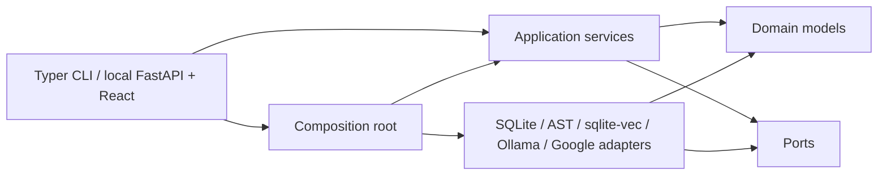

# Architecture

## Dependency direction

The domain contains validated application data, explicit errors, and pure derivations over
that data. Ports describe persistence, repository analysis, source/freshness checks,
retrieval, and reasoning. Application services depend on domain contracts and cohesive
ports. Adapters implement ports. The CLI and the local web adapter are thin presentation
adapters. `bootstrap.py` is the composition root and the only module that chooses providers.

The domain, application, and port packages do not import Typer, HTTPX, SQLite,
`sqlite-vec`, or adapter implementations. Structural tests enforce this boundary and ensure CLI
commands use application services instead of concrete repositories, analyzers, or stores.

## Responsibilities

- Domain: immutable schemas, IDs, classifications, source locations, errors — and the
  finding detectors, which are pure functions over an `Atlas`. They sit beside
  `atlas_metrics` rather than behind a port, because a port here would be an interface with
  a single implementation hiding nothing: the shape they exist to report.
- Application: case operations, the boundary-review service, review conversations, bundled
  examples, repository indexing, atlas queries, policy sources, workspace initialization,
  safety, and Markdown rendering.
- Ports: narrow reasoning, atlas/source/freshness, policy and persistence interfaces.
- Persistence adapters: connection lifecycle, migrations, immutable reviews and revisions.
- Analysis adapters: one-snapshot Python parsing, graph metrics, safe source reads, and
  deterministic typed queries. Named `adapters/analysis` rather than `adapters/repository`,
  which collided with the persistence sense of "repository" used by the ports.
- Retrieval adapters: policy parsing and chunking. Embeddings and vector search remain built
  and unused: the review path presents the whole corpus and retrieves nothing.
- Model adapters: the two structured reasoning stages and the transports that carry them.
- Presentation: input validation, application-service calls, output, and exit behavior only.

The local web adapter adds no alternate domain path — FastAPI routes call the same
application services as the CLI, and the React bundle consumes their JSON. A review runs
synchronously inside its request: it is one model call per boundary against an
already-indexed atlas, so there is no job queue and nothing to recover after an interrupted
process.

Reasoning stages are separated from model transport. `adapters/models/structured.py` owns
every stage: what the model is told, which handles it may reference, how the response schema
is narrowed, and the single repair round. A `ChatTransport` owns only what genuinely differs
between vendors — request options, timeouts, retries, and translating a failure into
`ProviderError`. `ollama.py` and `google.py` are transports; neither carries stage logic, so
a prompt or schema change is made once. This is what the
`separate-model-context-from-provider-transport` policy asks for.

Model transport is bounded and explicit. Before any request is sent, the shared stage layer
estimates the serialized prompt plus the response schema against the context window and
refuses with `PromptBudgetExceededError` when the request cannot fit, naming the stage and
both sizes; Ollama would otherwise truncate from the front and discard the system prompt,
producing degraded output that fails validation with no attributable cause. Gemini fails the
same shape differently — it spends thinking tokens from the output allowance and can stop at
`MAX_TOKENS` having emitted no JSON — so the Google transport reports that case by name
instead of returning a truncated response. Transport
failures that a later identical request might survive — timeouts, network and remote
protocol errors, proxy errors, 408/429/5xx — are retried up to three times with
exponential backoff. Configuration faults and structured-output failures are never
retried; the single sanctioned schema-repair round remains the only second attempt at
content. Stages are timed by class, with the single configured timeout as the fallback so
a workspace written before the classes existed behaves identically.

Heavyweight or provider-specific behavior is constructed explicitly. Imports have no side effects.
The packaged model configuration is a resource; workspace initialization copies it only when the
selected configuration path does not exist.

Review conversations use the same dependency direction and need far less machinery than
the consultation conversations they replaced. A whole review serialises to roughly 25,000
characters, so the service hands the pinned review, the history and the question to the
stage; there is no cumulative ceiling to apply and no rolling summary to revise. A
structural test enforces that `adapters/models` may not import the application package, so
a model adapter cannot become the thing that decides what evidence an answer rests on —
including the background described next, which the service assembles and passes in.

Reasoning stages are named once by the `ReasoningTask` enum rather than by repeated string
literals, and a test asserts the enum and the prompt registry are the same set, so a stage
without a contract cannot reach a runtime `KeyError`.

`bootstrap.Runtime` names its dependencies by port, so nothing outside the composition root
depends on a concrete SQLite, AST, or vector-store type.

## Information flow

Two stages exist, and the application decides the inputs to both.

**Judging a candidate.** `domain/finding_detectors.py` derives candidates from an `Atlas`
deterministically and completely — not sampled, not ranked. Each goes to the model with the
case and the whole policy corpus. Policies are presented in a fixed order without their
identifiers, and the reply returns one bearing per policy in that same order; identity is
attached afterwards from the position. The response grammar fixes the array length to the
policy count and the stage re-checks it after parsing, because a short reply would not lose
one answer — it would shift every later answer onto the wrong policy and still validate.

**Answering a question about a review.** The whole review goes into every turn, about
25,000 characters against an input budget near 490,000. There is no cumulative budget and
no rolling summary, because the evidence fits. Boundaries are presented without their
`BR-nnn` codes and the answer marks supporting ones by position.

Alongside it goes *background*: the bundled method primer
(`archcompass/knowledge/method.md`) and the whole policy corpus, so a reader can ask what a
boundary is or what a policy argues rather than only what this review found. Evidence and
background are different things and the separation is the point. The review is evidence —
always present in full and the only thing that can ground an answer. Background says what
the review's words *mean*, and is never citable.

**Background is presented whole, not retrieved.** An sqlite-vec index over this corpus was
built and measured before this was settled. Over 252 chunks and ten questions with known
answers it scored 7/10 top-1 with `embeddinggemma` (768d) and 2/10 with the deterministic
test embedder — and it missed the primer's own "what the detector cannot see" section when
asked exactly that. The corpus is about 45,000 characters against an input budget near
490,000, so it fits several times over and ranking only introduced a way to lose the passage
that mattered. Retrieval earns its complexity when the evidence does not fit; here it does.

A corpus that cannot be read is not a conversation failure: background degrades to the
bundled primer alone and the question is still answered, rather than taking a working
conversation off a person.

Neither stage receives an `Atlas` aggregate, a repository root, or a complete source tree.

Response field order is part of each contract. A structured-output model fills a schema in
the order it is declared, so a conclusion declared before its reasoning is a conclusion
reached before its reasoning: `rationale` precedes `material`, and `answer` precedes
`supported_by`. This is not stylistic — declared the other way round, a live run returned
`material: false` beside a rationale concluding that removing the abstraction would cost
nothing, and both halves validated.

The review path is deliberately short. `domain/finding_detectors.py` derives finding candidates from an `Atlas` — a pure
function over domain data, beside `atlas_metrics` rather than behind a port, because a port
here would be an interface with one implementation hiding nothing. `ReviewService`
loads the case and the latest atlas, checks freshness, orders the whole policy corpus once,
and calls the judgement stage once per candidate.

That stage sends no policy identifier and reads none back. Policies are presented in the
fixed order the application chose and the response returns one bearing per policy in the
same order, so identity is attached by position; the response grammar fixes the array
length to the policy count and the stage re-checks it after parsing, because a short reply
would otherwise shift every later answer onto the wrong policy and still validate. Verdicts
that find nothing material are kept and printed alongside the rest: a report showing only
problems reads the same whether the advisor cleared every candidate or never looked.

Embedding retrieval and exact reference selection are intentionally separate. Policies are an
open corpus, so their sections are embedded and retrieved before the original text is supplied to
reasoning. The force list at clustering is already complete and bounded, so the adapter uses
schema-constrained request-local handles and deterministic mapping instead of vector similarity.
