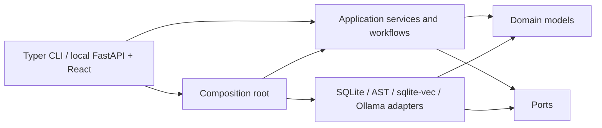

# Architecture

## Dependency direction

The domain contains validated application data and explicit errors. Ports describe persistence,
repository analysis, source/freshness checks, retrieval, reasoning, and report output.
Application services and workflows depend on domain contracts and cohesive ports. Adapters
implement ports. The CLI is a thin presentation adapter. `bootstrap.py` is the composition root
and the only module that chooses providers.

The domain, application, workflow, and port packages do not import Typer, HTTPX, SQLite,
`sqlite-vec`, or adapter implementations. Structural tests enforce this boundary and ensure CLI
commands use application services instead of concrete repositories, analyzers, or stores.

## Responsibilities

- Domain: immutable schemas, IDs, classifications, source locations, and errors.
- Application: case, policy-source/index, repository-index, fresh-atlas-query, advice, report,
  report-conversation planning/retrieval/context/validation, run, workspace-initialization,
  safety, and evidence-validation use cases.
- Workflows: the unified consultation sequence and its audit/failure envelope.
- Ports: narrow model/reasoning, atlas/source/freshness, policy, persistence, and reporting
  interfaces.
- Persistence adapters: connection lifecycle, migrations, immutable revisions and versions.
- Repository adapters: one-snapshot Python parsing, graph metrics, safe source reads, and
  deterministic typed queries.
- Retrieval adapters: policy parsing, chunking, embeddings, and vector search.
- Model adapters: structured reasoning tasks, closed-set reference mapping, and embeddings.
- Presentation: input validation, application-service calls, output, and exit behavior only.

The local web adapter adds no alternate domain path. FastAPI routes call the same application
services as the CLI, while the React bundle consumes JSON and server-sent progress events from
that adapter. A single-worker application queue fixes a run ID and input case revision before
calling the consultation workflow.

Report-conversation access remains in the CLI and local FastAPI routes. The retained React
workspace has no report-conversation or generic chat controls in V1.2.

Heavyweight or provider-specific behavior is constructed explicitly. Imports have no side effects.
The packaged model configuration is a resource; workspace initialization copies it only when the
selected configuration path does not exist.

Persisted-report conversations use the same dependency direction. The application builds a
bounded planning dossier from compact finding digests, the exact pinned case summary, the current
typed summary, and recent message views. It resolves finding references, validates at most eight
discriminated retrieval actions, applies all evidence ceilings cumulatively across the turn, and
executes only against the run's exact case/Atlas/policy pins.

Retrieval returns a transient evidence payload for reasoning and a separate lightweight audit
record for persistence. The transient `ReportConversationContext` preserves exact relationship
edges, dependency-path order, tests, concern implications, query summaries, excerpts, and
unavailable reasons without containing an `Atlas` aggregate, repository root, source tree, full
policy corpus, or unlimited history. Durable message rows retain ordered scoped artifact
references, actual supplied IDs, truncation metadata, recent-message ordinals, summary revision,
and a canonical context hash; they do not duplicate findings, claims, Atlas query results, or
policy documents.

The narrow `ReportConversationReasoner` receives only provider-neutral typed dossiers. The
application owns reference resolution, exact artifact scope, cumulative budgets, validation,
repair allowlists, rendering, and summary coverage. Model adapters serialize the same canonical
JSON used for hashes and do not choose evidence, history, citation, or truncation rules.
Conversation adapters and services are composed only in `bootstrap.py`.

## Information flow

Global context remains concise. Detailed code is requested only through a validated
`AtlasQueryPlan`; the query executor bounds types, IDs, result sizes, depth, and source excerpts.
Design forces are partitioned into validated concern clusters, and detailed results are assembled
into one focused packet per cluster under cumulative node and excerpt budgets. Final synthesis
receives the case, global context, forces, clusters, concern analyses, alternatives, scenarios,
and canonical policy summaries. Focused packets remain internal evidence allowlists and are not
sent to synthesis. The model never receives an `Atlas` aggregate, repository root, or complete
source tree.

Embedding retrieval and exact reference selection are intentionally separate. Policies are an
open corpus, so their sections are embedded and retrieved before the original text is supplied to
reasoning. The force list at clustering is already complete and bounded, so the adapter uses
schema-constrained request-local handles and deterministic mapping instead of vector similarity.
