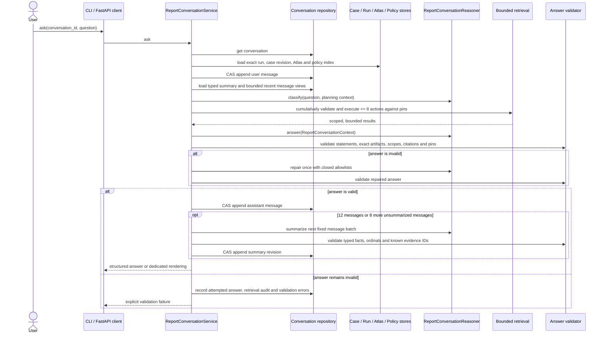

# Report conversations

`ReportConversation` provides evidence-grounded questions and answers about one immutable,
successful `ConsultationRun`. It explains a historical recommendation; it does not reopen the
consultation, mutate the `ArchitectureCase`, or synthesize across runs.

## Lifecycle



Creation succeeds only when the run exists, succeeded, has a validated report, and every pinned
identity can be resolved. Each turn reloads the exact input case revision, report, Atlas version,
and policy-index version recorded by that run. Later case changes, Atlas rebuilds, and policy
rebuilds do not change an existing conversation.

## Planning and retrieval

The classifier receives a bounded planning context and returns a typed `ReportQuestionPlan`.
Finding IDs, normalized exact titles, numeric or word ordinals from one through twelve, and
unambiguous references to recent messages are resolved before execution. Multiple exact-title
matches may be retained for an explicit comparison; otherwise ambiguity is reported rather than
guessed. Every ID and action is validated against the pinned run or exact evidence already
surfaced in the conversation.

The mandated hard ceilings are defined once, as constants in `archcompass.domain.budgets`.
Workspace configuration may lower any of them to tighten a run; none can be raised, and the two
values that admit exactly one setting — summary coverage of the first twelve messages, then fixed
batches of eight — are not exposed as configuration at all. The ceilings are:

- 8 retrieval actions;
- 12 retrieved findings;
- 24 unique Atlas nodes, including path nodes;
- 8 pinned-run policies;
- dependency-neighbourhood depth 2;
- 120 lines in one excerpt;
- 180 excerpt lines in one turn;
- 24,000 characters of serialized retrieved results.

These are per-turn cumulative ceilings, not per-action allowances. Retrieval clamps each action to
the remaining finding, node, policy, excerpt-line, and character capacities, records truncation or
unavailability, and stops before a later action can exceed the total. Actions cover findings,
report claims, concern analyses, alternatives, scenarios, Atlas nodes/search/metrics/signals/
dependencies/paths/excerpts, policies, and metric definitions. Structural Atlas queries always
use the pinned persisted graph. Source excerpts additionally require repository contents that
still match that Atlas version. If they do not, the result is recorded as unavailable; there is no
fallback to the current tree.

Policy retrieval is closed to the policies retained in the run's focused packets and the exact
pinned index. It never searches a later policy index.

## Evidence scopes

The service builds an exact original-run registry from the validated report and focused packets.
Every retrieved node, relationship, metric value, signal, and excerpt is scoped independently:

- `original_run`: evidence already surfaced for and capable of informing the historical report;
- `additional_conversation`: structural evidence found later from the same pinned Atlas.

A newly retrieved relationship, metric, signal, or excerpt about an original node is still
additional unless that exact artifact was retained by the run. One query may therefore contain a
mix of original and additional items. Additional evidence can clarify the report but must not be
described as having influenced the original recommendation.

Structured `AnswerClaim` values cite allowlisted exact artifact IDs, findings, report claims, and
policies. Direct answers, supporting points, and uncertainty are typed statements whose support
links are validated too; free prose cannot bypass claim validation. Repository observations use
the exact artifact value and location, and policy guidance requires a pinned policy citation.
Rendered answers place additional evidence under the explicit heading
“Additional repository evidence retrieved during conversation.”

## Bounded reasoning context

The provider-neutral `ReportConversationContext` contains:

- consultation and evidence-version identities;
- a compact report summary;
- all one to twelve compact finding digests;
- the exact input case revision's title, problem, desired outcome, actors and workflows,
  requirements, quality attributes, technical, organisational, and derived constraints, confirmed
  facts, expected future changes, non-goals, and assumptions;
- the validated question plan and current typed rolling summary;
- at most eight recent messages;
- only question-specific retrieved claims, nodes, relationships, ordered dependency paths,
  metrics, signals, excerpts, tests, policy applicability/exceptions, concern implications,
  alternatives, scenarios, query summaries, and unavailable reasons.

It never contains an `Atlas` aggregate, repository root, source tree, complete policy corpus, or
unlimited conversation history. If the serialized context still exceeds its hard application
budget after conservative projection, the turn fails before reaching a model provider.

After an assistant message is committed, the service summarizes exactly the first 12 uncovered
messages and then fixed batches of 8. The typed summary records descriptive narrative, discussed
finding/evidence IDs, and user corrections, hypotheticals, and unresolved questions with their
source ordinals. Its narrative is capped at 6,000 characters, and its typed collections have
separate model bounds. It may retain known evidence IDs but may not invent facts or IDs. Invalid
summaries do not advance coverage. A summary-provider or persistence failure is recorded
separately and does not turn the already-persisted answer into a failed request.

## Counterfactuals and read-only boundaries

Counterfactual questions are labelled hypotheticals. An answer may explain how a force,
alternative, or confidence assessment could change under the proposed condition, but the
persisted report remains the historical recommendation. Making the hypothetical authoritative
requires a new `ArchitectureCase` revision and a new consultation.

Conversation operations never:

- update an `ArchitectureCase`;
- supersede or edit a report;
- start a consultation;
- use the latest Atlas or policy index as a fallback;
- read an unpinned current source tree;
- combine evidence from multiple runs;
- execute code or modify the analysed repository.

## Persistence and access

Messages and summary revisions are append-only. Conversation rows carry a compare-and-swap
revision; each append validates both the expected revision and next unique ordinal in one SQLite
write transaction. Assistant rows require their structured answer, lightweight retrieval audit,
model identity, and prompt identities. The retrieval audit stores ordered scoped references,
actual supplied IDs, recent-message ordinals, summary revision, truncation/unavailability data,
and a canonical 64-character context hash. It does not copy findings, report claims, Atlas query
results, or policy documents into message storage.

A failed answer leaves the user message in history, records the attempted structured answer,
retrieval audit, stage, validation errors, model, and attempted prompt identities, and does not
append an assistant message. Repository reads for classification, recent context, summary batches,
and previously surfaced evidence are bounded rather than loading the complete thread on ordinary
turns.

CLI access:

```text
archcompass conversation create --run RUN_ID
archcompass conversation list --run RUN_ID
archcompass conversation show CONVERSATION_ID
archcompass conversation ask CONVERSATION_ID "question" [--json]
archcompass conversation history CONVERSATION_ID
archcompass conversation export CONVERSATION_ID --format markdown|json
```

Equivalent local FastAPI routes live under `/api/conversations`. They publish reusable
`ProblemDetail` contracts for not-found, conflict, validation, and provider-unavailable responses;
exports advertise both `application/json` and `text/markdown`. V1.2 intentionally has no React
conversation interface. A missing consultation run raises the dedicated `RunNotFoundError` and
maps to HTTP 404. The former run follow-up route and UI are removed. Its deprecated SQLite table
and rows remain intact and are not converted into conversations.

## Limitations

- Repository evidence is deterministic static analysis, not runtime telemetry.
- Additional structural evidence does not retroactively strengthen the historical decision.
- Source excerpts become unavailable when the repository no longer matches the pinned Atlas.
- The workflow cannot answer production latency, traffic, incident, or operational-state
  questions unless such evidence was explicitly persisted in the run.
- A summary compresses dialogue and is not an independent evidence source.
- Conversations are single-run and read-only; there is no cross-run synthesis, interactive REPL,
  generic agent framework, or autonomous refactoring.
